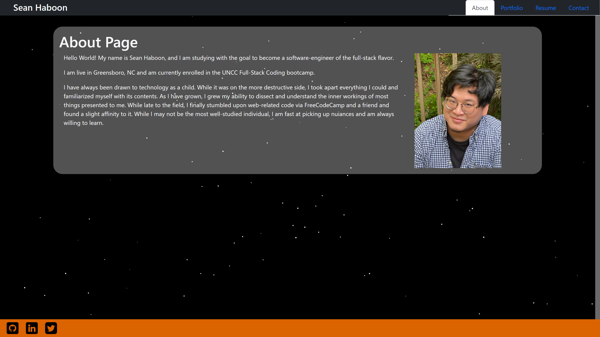

# React Portfolio

## Description

This application is a Note Taker. Within the program you may find the ability to take and record notes.

\
.png>)

## Table of Contents

[Installation](#Installation) |
[Usage](#Usage) |
[Credits](#Credits) |
[License](#License) |
[Features](#Features) |
[How To Contribute](#How-To-Contribute) |
[Tests](#Tests)

## Installation

N/A - In Browser Application

Application Link:\
https://cuddly-enigma.herokuapp.com/

## Usage

Application Type: This is a browser based Portfolio. Look at the deployed site to see if you want to know more about

Application Link:

## Credits

Sean Haboon, Chris Snyder

License Badges Taken From:

Lukas Himsel
https://gist.github.com/lukas-h/2a5d00690736b4c3a7ba

## License

https://www.mit.edu/~amini/LICENSE.md

      MIT License

      Copyright (c) [2023] [Sean Haboon]

      Permission is hereby granted, free of charge, to any person obtaining a copy
      of this software and associated documentation files (the "Software"), to deal
      in the Software without restriction, including without limitation the rights
      to use, copy, modify, merge, publish, distribute, sublicense, and/or sell
      copies of the Software, and to permit persons to whom the Software is
      furnished to do so, subject to the following conditions:

      The above copyright notice and this permission notice shall be included in all
      copies or substantial portions of the Software.

      THE SOFTWARE IS PROVIDED "AS IS", WITHOUT WARRANTY OF ANY KIND, EXPRESS OR
      IMPLIED, INCLUDING BUT NOT LIMITED TO THE WARRANTIES OF MERCHANTABILITY,
      FITNESS FOR A PARTICULAR PURPOSE AND NONINFRINGEMENT. IN NO EVENT SHALL THE
      AUTHORS OR COPYRIGHT HOLDERS BE LIABLE FOR ANY CLAIM, DAMAGES OR OTHER
      LIABILITY, WHETHER IN AN ACTION OF CONTRACT, TORT OR OTHERWISE, ARISING FROM,
      OUT OF OR IN CONNECTION WITH THE SOFTWARE OR THE USE OR OTHER DEALINGS IN THE
      SOFTWARE.

## Features

This features some information about me and some of the things I've made.

## How to Contribute

Since this is my portfolio, there will be no way to fully contribute.

## Tests

N/A
